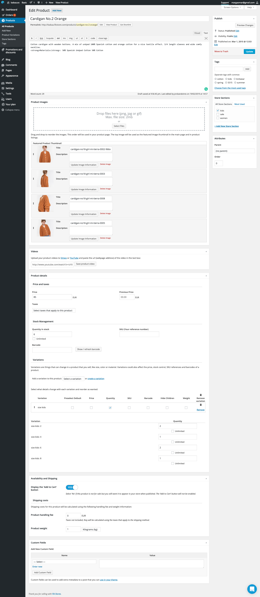
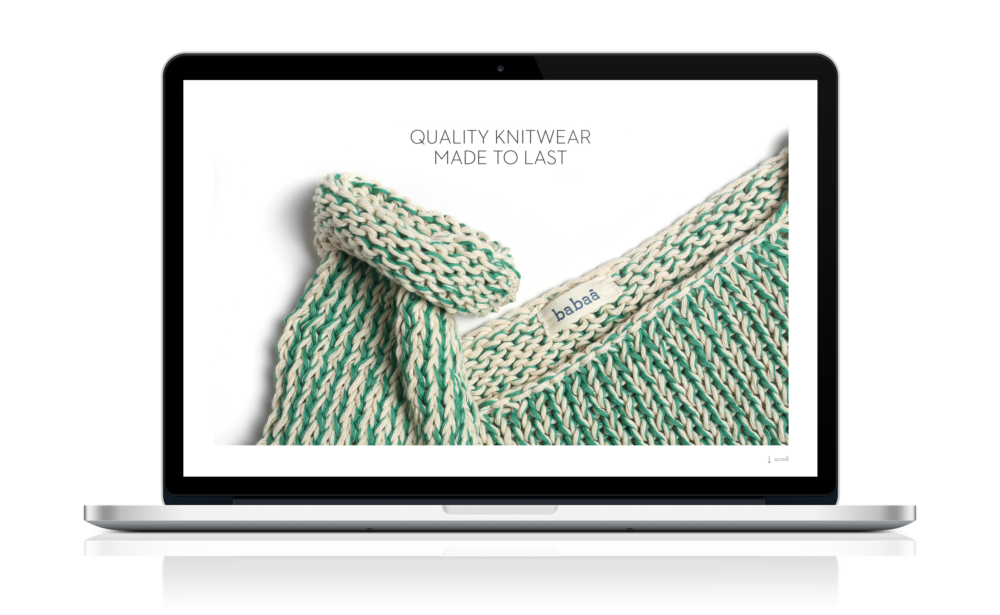
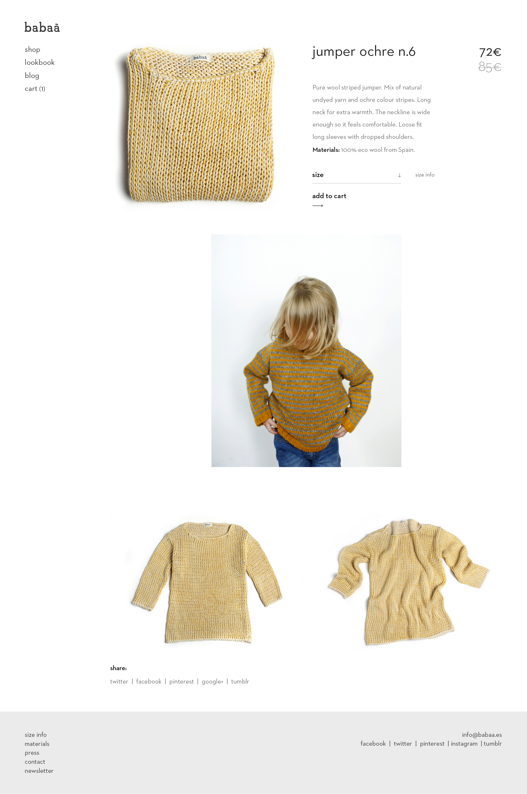
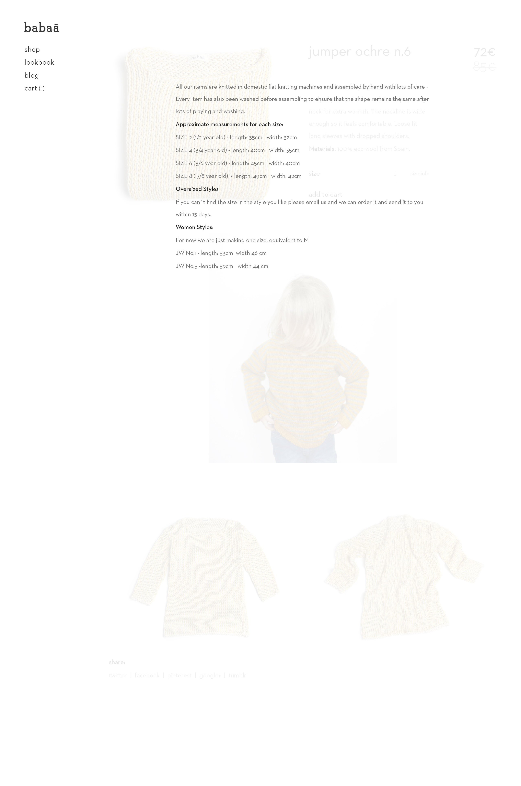
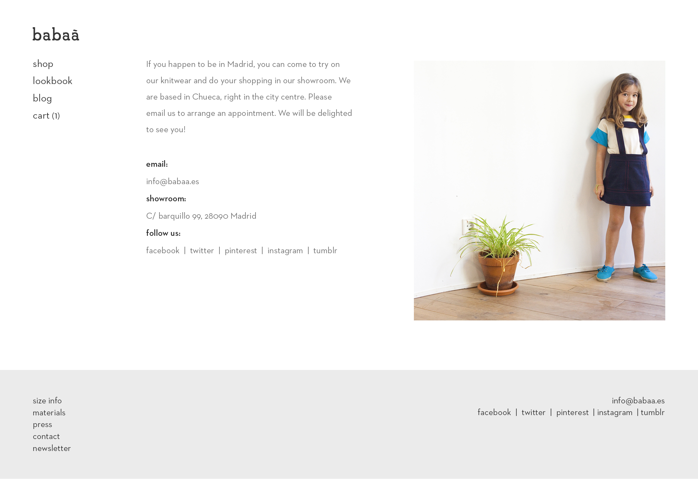

# Babaà, a Wordpress online store

> Wordpress Theme for Babaà brand.

----
## What this theme include?

> Babaà is a quality knitwear for everyday use. I developed the Theme, bringing the wireframes of the UX designer to life, as well as collaborating with Back End Developers to develop the different plugins, widgets and shortcodes to create a stellar finished product. A bootstrap framework based, fully responsive and mobile first layout.

----
## Go to the projects
You can see this project live going to: 

>* **[babbà](http://babaa.fikstore.com/)**

----
## Screenshots
**Dashboard**

----

**Home**

----

----

**Store**

----

**Single product**

----

----

**Blog**

----

**Contact**

----
## Date
>* Feb-2015

----
## Company
>* [babbà](http://babaa.es/)

----
## Agency
>* [FikStores](https://thefik.com)

